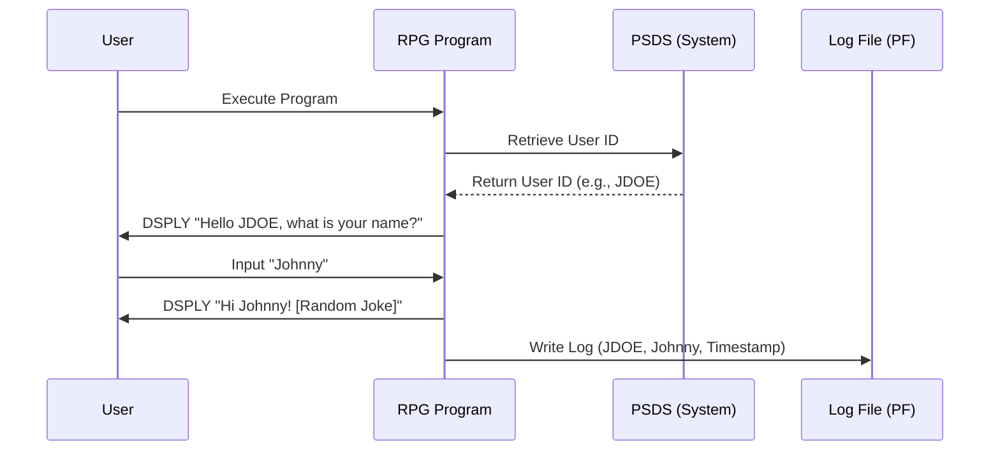

# Architecture Decision Document - RPG Modernization PoC

## 1. Technical Stack
- **Language:** RPG IV (ILE)
- **Environment:** IBM i (PUB400.com)
- **Compiler:** CRTBNDRPG (Create Bound RPG Program)

## 2. Technical Decisions

### TD1: User Identification via PSDS
The program will utilize the standard Program Status Data Structure (PSDS) to automatically retrieve the `USER` field (positions 254-263). This ensures reliable identification of the job user without requiring manual input or external API calls.

### TD2: Console I/O via DSPLY
To maintain simplicity and compatibility with basic terminal emulators (5250), the `DSPLY` opcode will be used for all user interactions, including displaying greetings, jokes, and capturing the user's preferred name.

### TD3: Interaction Logging
A Physical File (PF) will be defined to store interaction logs. Each record will include:
- User ID (from PSDS)
- Preferred Name (from user input)
- System Timestamp
This approach provides a structured audit trail that is easy to query using SQL or native I/O.

## 3. Sequence Diagram

## 4. Technical Requirements for Implementation
- **Infrastructure:** Access to PUB400 with authority to create and write to Physical Files.
- **Logging:** Implementation must handle file locking or use a non-locking write if multiple users execute the program simultaneously.
- **Data Model:** A simple PF named `INTLOG` with fields `LOGUSER`, `LOGNAME`, and `LOGTIME`.
- **PSDS Structure:** Program must define the PSDS structure in the D-specs to extract positions 254-263.
